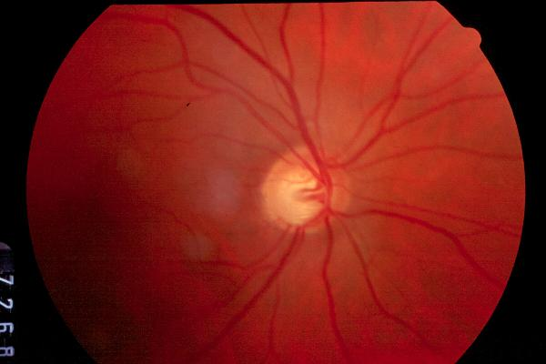

# Optic-Disc-Segmentation

##### The problem statement comes under bio-medical image processing.

A retinal disease called glaucoma needs to be detected at early stage to prevent blindness. To prevent this, CDR i.e Cup-to-Disc Ratio is calculated by segmenting optic disc and optic cup from retinal images.

##### A deep-learning based approach to segment optic disc from retinal images that are captured from fundus camera.

###### Network Architecture: U-Net (Encoder-Decoder Network)

Below is a sample Retinal Image:

Here is the segmented Optic disc from retinal image:

